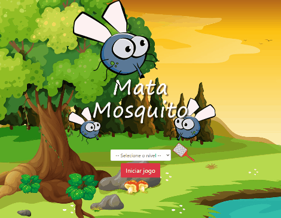

# FLy Swatter

> A simple fly swatter browser game using Javascript.

*Read it in other languages:* [English](https://github.com/filimor/fly-swatter/blob/master/README.md) :us:,
[Português (Brasil)](https://github.com/filimor/fly-swatter/blob/master/README.pt-BR.md) :brazil:

## Description

This project was made based on the online course 'Desenvolvimento Web Completo 2020 - 20 cursos + 20 projetos' (Full Web
Development - 20 courses + 20 projects) available at [Udemy](https://www.udemy.com/course/web-completo/) and taught by
[Jorge Sant Ana](https://linkedin.com/in/jorgesantanabr) and
[Jamilton Damasceno](https://linkedin.com/in/jamiltondamasceno). It consists of some html pages for the views and a
script that runs the game. For now, it only runs directly on a browser.

## Screenshot

## How to play

Open the index.html file in a browser. Select the difficulty level, which will determine the spawn interval of flies Once the
game has started, just click on all the flies that appear on the screen until the count down has ended. If you can beat
them all, you win. If you miss, you lose a life. Losing all 3 lives will lead to a game over.

## Build With

- [Visual Studio Code](https://code.visualstudio.com/)
- [Firefox Developer Edition](https://www.mozilla.org/en-US/firefox/developer/)

## Translations

- [English](https://github.com/filimor/fly-swatter/blob/master/README.md)
- [Português (Brasil)](https://github.com/filimor/fly-swatter/blob/master/README.pt-br.md)

## Credits

- The original project was designed and built by Jorge Sant Ana.
- The implementation and improvements were made by [@filimor](https://github.com/filimor)

## Contact

- [E-mail](mailto:filimor@posteo.net)
- [LinkedIn](https://www.linkedin.com/in/filimor/)
- [Twitter](https://www.twitter.com/filimorbr/)

## License

This project is licensed under the MIT License - see the
[LICENSE.md](https://github.com/filimor/fly-swatter/blob/master/LICENSE "MIT") file for details.
